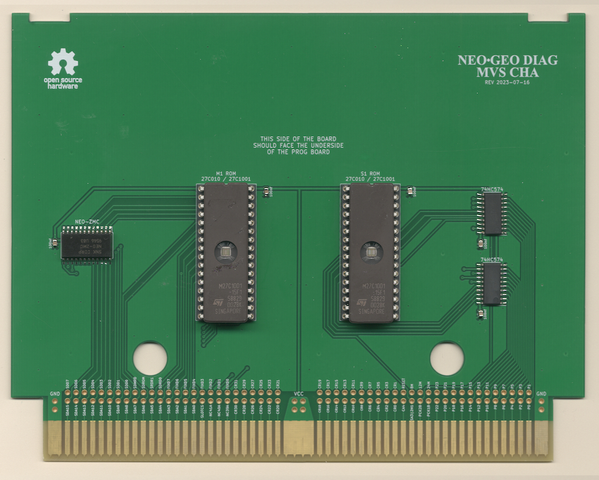
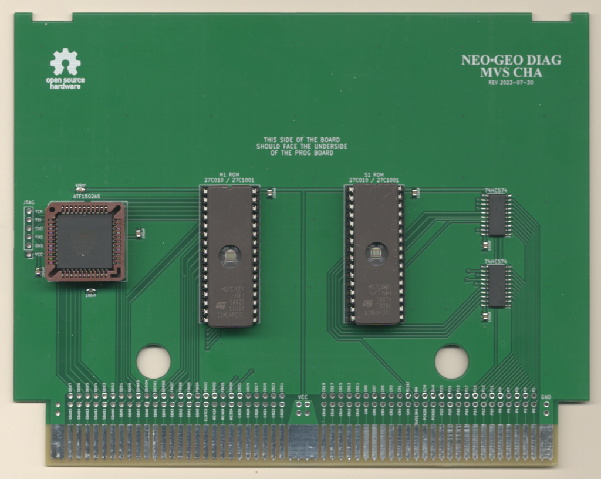
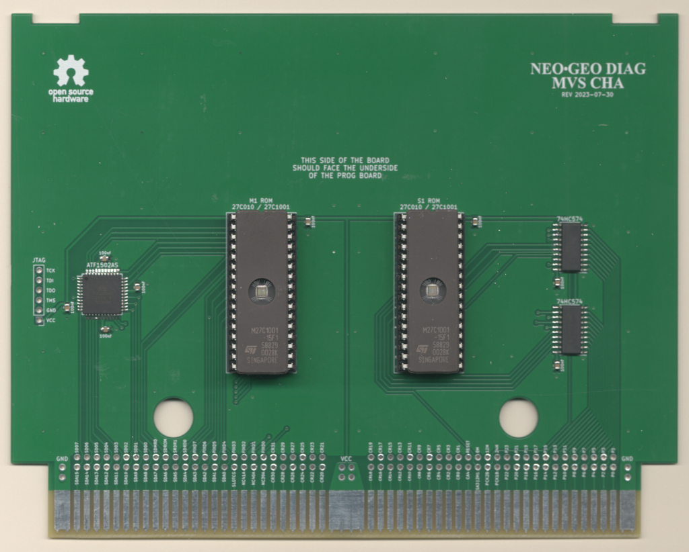
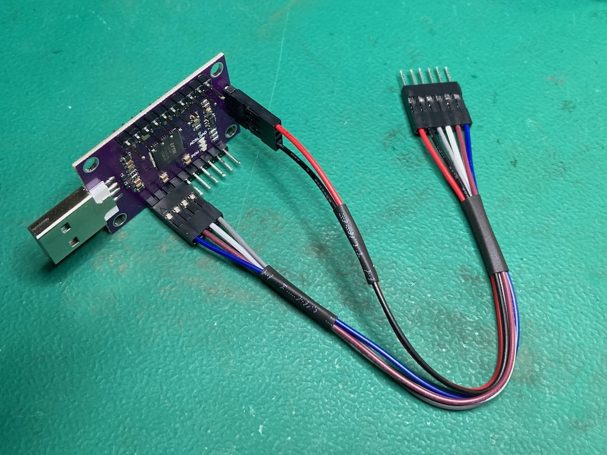
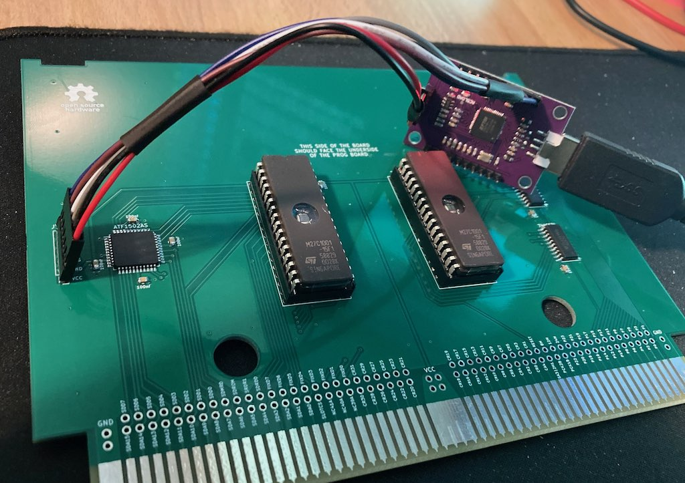

# neogeo-diag-mvs-cha


## Overview
This is a custom NeoGeo MVS CHA board that is used in conjunction with the [NeoGeo Diag Bios](https://github.com/jwestfall69/neogeo-diag-bios) that allows for testing the Z80 sound system with a custom diag M1 rom.  This doesn't allow for any new type of testing that was done previously, but make it possible to create a diag CHA board without having to sacrifice a original SNK CHA board.

The NeoGeo uses bank switching to allow full access to the M1 rom.  This is normally handled by a custom NEO-ZMC chip on the CHA board.  I ended up making 3 different boards you can choose from to deal with this bank switching:

A Board that uses a original NEO-ZMC:
<br>

2 Boards that replace the NEO-ZMC with a CPLD (Socketed PLCC44 and TQFP44):



Personally I would go with the NEO-ZMC based board since the NEO-ZMC is available as NOS for around $2 each.  More on this in the BOM below.  Additionally with the chip shortage its a little difficult to get the CPLDs, plus the fun of programming them.

## PCB Manufacturing
PCB should be 1.6mm thickness.  With these boards likely being inserted and removed numerous times its suggested you use ENIG surface finishing and gold fingers w/chamfering.

I've been using [jlcpcb](https://jlcpcb.com/) for PCB manufacturing.  Just watch out that by default they will add an order number to the silk screen unless you tell them not to.

## BOMs
**IMPORTANT:**

  * The 32 pin DIP sockets listed in the BOMs are special low profile ones.  Normal sockets + EPROM are to tall for the board to be able to fit behind the PROG board.
  * Stock of the CPLD is pretty low everywhere.  If you can't find them on digikey/mouser, you might be able to buy them directly from [Microchip](https://www.microchipdirect.com/).
  * If you buy a used CPLD its possible the JTAG pins were repurposed as I/O pins.  This will make it impossible to re-program with JTAG.
  * When buying the EPROMs I would advise against buying any that claimed to be new.  Sellers claiming this maybe trying to sell 
  slower speed variants re-labeled as something faster or just straight up fakes.

### NEO-ZMC based board
| Quantity | Description | Part Number | Digikey | Notes |
|:--------:|:------------|-------------|---------|-------|
| 1        | NEO-ZMC | NEO-ZMC | | NOS Availible:<br> - On [Aliexpress](https://www.aliexpress.us/item/2251832763681253.html?gatewayAdapt=glo2usa4itemAdapt)<br>- On [arcade-projects.com](https://www.arcade-projects.com/threads/openkeys-neogeo-diag-prog-boards.24392/) |
| 2        | 74HC574 pin 14 SOIC | SN74HC574NSR | [296-31816-1-ND](https://www.digikey.com/en/products/detail/texas-instruments/SN74HC574NSR/1571235) | |
| 2       | Low Profile 32pin DIP Socket | 115-93-632-41-003000 | [ED5632-ND](https://www.digikey.com/en/products/detail/mill-max-manufacturing-corp/115-93-632-41-003000/81902) | This is optional if you want just solder the eproms to the board |
| 2       | 1Mbit (128k x 8bit) 32 pin EPROM, 150ns or faster | 27C1001<br>or<br>27C010 | | |
| 5        | 100nf / 0.1uf Ceramic Capacitor 0805 Size | CL21B104KBCNNNC | [1276-1003-2-ND](https://www.digikey.com/en/products/detail/samsung-electro-mechanics/CL21B104KBCNNNC/3886661) | Any 100nf 0805 is fine |

### CPLD PLCC44 (Socket) based board
| Quantity | Description | Part Number | Digikey | Notes |
|:--------:|:------------|-------------|---------|-------|
| 1        | CLPD PLCC 44 pin | Microchip/Atmel ATF1502AS-xxJU44<br>or<br>ATF1504AS-xxJU44 | [ATF1502AS-7JX44-ND](https://www.digikey.com/en/products/detail/microchip-technology/ATF1502AS-7JX44/1027048)<br>[ATF1504AS-10JU44](https://www.digikey.com/en/products/detail/microchip-technology/ATF1504AS-10JU44/1118923) | Other speeds should work too |
| 1        | PLCC 44 pin through hole socket | | | |
| 2        | 74HC574 pin 14 SOIC | SN74HC574NSR | [296-31816-1-ND](https://www.digikey.com/en/products/detail/texas-instruments/SN74HC574NSR/1571235) | |
| 2       | Low Profile 32pin DIP Socket | 115-93-632-41-003000 | [ED5632-ND](https://www.digikey.com/en/products/detail/mill-max-manufacturing-corp/115-93-632-41-003000/81902) | This is optional if you want just solder the eproms to the board |
| 2       | 1Mbit (128k x 8bit) 32 pin EPROM, 150ns or faster | 27C1001<br>or<br>27C010 | | |
| 8       | 100nf / 0.1uf Ceramic Capacitor 0805 Size | CL21B104KBCNNNC | [1276-1003-2-ND](https://www.digikey.com/en/products/detail/samsung-electro-mechanics/CL21B104KBCNNNC/3886661) | Any 100nf 0805 is fine |

### CPLD TQFP44 based board
| Quantity | Description | Part Number | Digikey | Notes |
|:--------:|:------------|-------------|---------|-------|
| 1        | CLPD TQFP 44 pin | Microchip/Atmel ATF1502AS-xxAU44<br>or<br>ATF1504AS-xxAU44 | [ATF1502AS-10AU44](https://www.digikey.com/en/products/detail/microchip-technology/ATF1502AS-10AU44/1008375)<br>[ATF1504AS-10AU44](https://www.digikey.com/en/products/detail/microchip-technology/ATF1504AS-10AU44/1008359) | Other speeds should work too |
| 2        | 74HC574 pin 14 SOIC | SN74HC574NSR | [296-31816-1-ND](https://www.digikey.com/en/products/detail/texas-instruments/SN74HC574NSR/1571235) | |
| 2       | Low Profile 32pin DIP Socket | 115-93-632-41-003000 | [ED5632-ND](https://www.digikey.com/en/products/detail/mill-max-manufacturing-corp/115-93-632-41-003000/81902) | This is optional if you want just solder the eproms to the board |
| 2       | 1Mbit (128k x 8bit) 32 pin EPROM, 150ns or faster | 27C1001<br>or<br>27C010 | | |
| 8       | 100nf / 0.1uf Ceramic Capacitor 0805 Size | CL21B104KBCNNNC | [1276-1003-2-ND](https://www.digikey.com/en/products/detail/samsung-electro-mechanics/CL21B104KBCNNNC/3886661) | Any 100nf 0805 is fine |

## Assembly
  * Reminder from above that normal 32 pin DIP sockets will be to tall
  * On the NEO-ZMC board, take note of pin 1 location of the NEO-ZMC chip as its rotated 180 degrees from what you might expect.

## Programming the CPLD

Both CPLD based boards have a JTAG port on left side that can be used for programming the CPLD.  I've been using this [FT232H](https://www.amazon.com/dp/B07T9CPMHT?psc=1&ref=ppx_yo2ov_dt_b_product_details) based programmer along with [openocd](https://openocd.org/) software to program the CPLD.

Here is a picture of the programmer and the cable I made for it:



The programmer has pin labels on the bottom of the board.

| Programmer PIN | J-TAG PIN |
|:--------------:|:---------:|
| AD0            | TCK       |
| AD1            | TDI       |
| AD2            | TDO       |
| AD3            | TMS       |
| GND            | GND       |
| +5V            | VCC       |

I haven't done JTAG stuff before, but believe this programmer not normal in that its supplying 5V to power the CPLD, whereas I think most JTAG programmers rely on something else to supply power to the CPLD and the VCC/GND pins are just used for VCC/GND reference.

Since this programmer is supplying power, it would be powering the entire CHA board including to the EPROMS/74HC574 chips.  I haven't run into any USB over current issues doing this.  Obviously don't plug in the programmer into the CHA board if its also plugged into an MVS motherboard.

Its not necessary to solder the JTAG cable to the JTAG port on the CHA board, just insert the pins into the through hole and hold it an angle so the pins are touching the sides of the through holes like this:



As noted above I've been using openocd software for programming.  I've only used it on linux and it should be an existing package your distro.  For the following openocd commands below the location of the um232h.cfg maybe different depending on where your distro installs interface config files.  Additionally if you use a different programmer you might need to use a completely different interface config.

**Make sure the CPLD is detected**
```
# openocd -f /usr/share/openocd/scripts/interface/ftdi/um232h.cfg -c "adapter speed 400" -c "transport select jtag" -c init -c scan_chain -c shutdown

Open On-Chip Debugger 0.11.0+dev-snapshot (2023-02-14-01:09)
Licensed under GNU GPL v2
For bug reports, read
        http://openocd.org/doc/doxygen/bugs.html
adapter speed: 400 kHz

jtag
Info : clock speed 400 kHz
Warn : There are no enabled taps.  AUTO PROBING MIGHT NOT WORK!!
Info : JTAG tap: auto0.tap tap/device found: 0x0150403f (mfg: 0x01f (Atmel), part: 0x1504, ver: 0x0)
Warn : AUTO auto0.tap - use "jtag newtap auto0 tap -irlen 3 -expected-id 0x0150403f"
Warn : gdb services need one or more targets defined
   TapName             Enabled  IdCode     Expected   IrLen IrCap IrMask
-- ------------------- -------- ---------- ---------- ----- ----- ------
 0 auto0.tap              Y     0x0150403f 0x00000000     3 0x01  0x03

shutdown command invoked

```
You want to see an IdCode of 0x01504xxx or 0x01502xxx based on which CPLD you are using.

**Programming the CPLD**<br>
For programming you will need the .svf firmware file for the CPLD you are using.  In the below example I have a ATF1504AS-7AX44 TQFP CPLD, so I use the atf1504as-tqfp44.svf firmware.

```
# openocd -f /usr/share/openocd/scripts/interface/ftdi/um232h.cfg -c "adapter speed 400" -c "transport select jtag" -c init -c "svf atf1504as-tqfp44/atf1504as-tqfp44.svf" -c shutdown

Open On-Chip Debugger 0.11.0+dev-snapshot (2023-02-14-01:09)
Licensed under GNU GPL v2
For bug reports, read
        http://openocd.org/doc/doxygen/bugs.html
adapter speed: 400 kHz

jtag
Info : clock speed 400 kHz
Warn : There are no enabled taps.  AUTO PROBING MIGHT NOT WORK!!
Info : JTAG tap: auto0.tap tap/device found: 0x0150403f (mfg: 0x01f (Atmel), part: 0x1504, ver: 0x0)
Warn : AUTO auto0.tap - use "jtag newtap auto0 tap -irlen 3 -expected-id 0x0150403f"
Warn : gdb services need one or more targets defined
svf processing file: "atf1504as-tqfp44/atf1504as-tqfp44.svf"
TRST ABSENT;
ENDIR IDLE;
ENDDR IDLE;
HDR 0;
HIR 0;
TDR 0;
TIR 0;
RUNTEST 50021E-6 SEC;
STATE RESET;
STATE IDLE;
RUNTEST 50021E-6 SEC;
SIR 10 TDI (280);
SDR 10 TDI (1b9);
STATE IDLE;
SIR 10 TDI (059);
        MASK (ffffffff);
STATE IDLE;
SIR 10 TDI (2b3);
SIR 10 TDI (29e);

...

SIR 10 TDI (293);
        MASK (ffff);
STATE IDLE;
SIR 10 TDI (2a1);
SDR 11 TDI (100);
SIR 10 TDI (28c);
STATE IDLE;
RUNTEST 20001E-6 SEC;
SIR 10 TDI (291);
        MASK (ffffffff);
STATE IDLE;
SIR 10 TDI (280);
SDR 10 TDI (000);
STATE IDLE;
RUNTEST 10001E-6 SEC;
STATE RESET;
RUNTEST 50021E-6 SEC;

Time used: 0m12s393ms
svf file programmed successfully for 3299 commands with 0 errors

shutdown command invoked

```

## Programming the EPROMs
The M1 EPROM should be programmed using the diag M1 ROM provided with the neogeo diag bios.

The S1 EPROM can be programmed with most any S1 ROM from any game.  I usually just use 201-s1.s1 from mslug mame romset.
